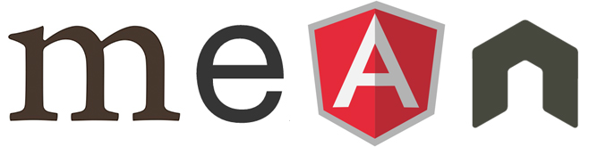

# SnapMap

### User Stories

**Bronze**
* As a user, I should be able log in to access the map.
* As a user, I should be able to upload a photo.
* As a user, I should be able to pin those photos to a marker on the map with their geolocation.
* As a user, I should able zoom in and out of a map.
* As a user, I should be able to click a marker and have the image render in a pop up.

**Silver**
* As a user, I should be able to map directions between each photo marker.
* As a user, I can choose different modes of transportation for the directions (e.g. plane, car, foot, bicycle, boat).

**Gold**
* As a user, I should be able to upload a photo and have the location automatically pop up as my geolocated spot.
* As a user, I should be able to add text to the marker popup for greater definition for the picture.
* As a user, I should be able to map multiple trips.
* As a user, I should be able to customize my routes with my specific path taken.

**Platinum**
* As a user, I should be able to see other people's trips and photos.
* As a user, I should be to use 2 modes of transportation in a single path (e.g. walk to a certain place, then bike to the next).

### Technologies

* MEAN Stack (MongoDB, Express.js, Angular.js, Node.js)

* Google Maps API
